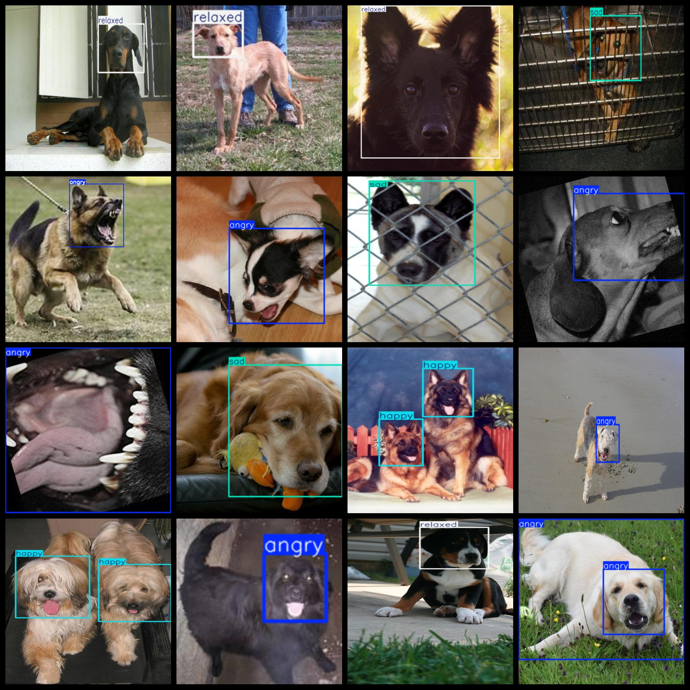
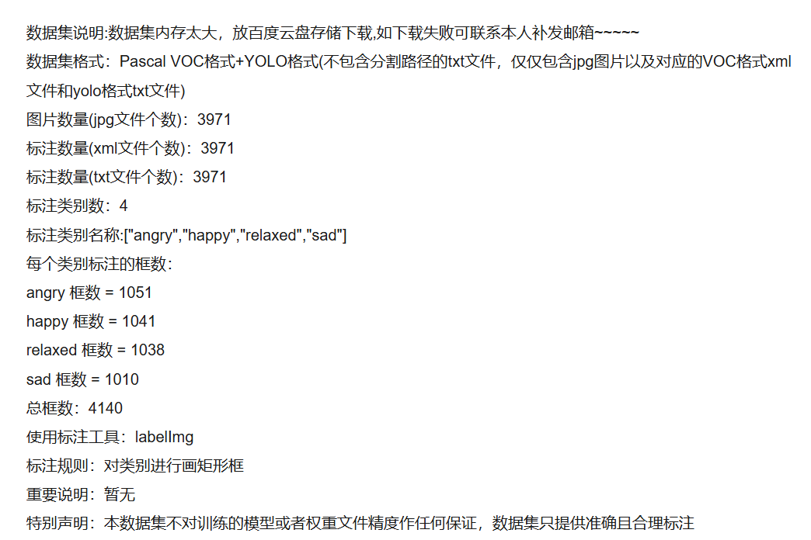
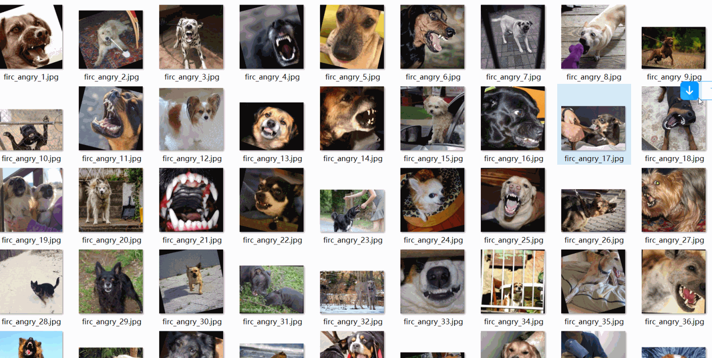

# [Object Detection Dataset] Dog Dog Expression Recognition VOC+YOLO format3971 images4-class

Dataset Description: ~

Dataset format: Pascal VOC format + YOLO format (the txt file does not contain the split path, it only contains jpg images and corresponding VOC format xml files and yolo format txt files)

Number of images (number of jpg files): 3971

Number of annotations (number of xml files): 3971

Number of annotations (number of txt files): 3971

Number of annotated categories: 4

Annotation class names: ["angry","happy","relaxed","sad"]

Number of boxes labeled in each category:

angry frame count = 1051

happy frame count = 1041

relaxed frame count = 1038

sad frame count = 1010

Total boxes: 4140

Use the labeling tool: labelImg

Rules for annotation: Draw a rectangle around the category.

Important Note: None

Special Notice: This dataset does not guarantee the accuracy or precision of the trained models or weight files. The dataset only provides accurate and reasonable annotations.

Annotation examples or image overview:

## Images

---

Here is a pay link on Stripe (https://buy.stripe.com/3cs8yP7sY87d0vu9AB). Please contact me lonlonago@foxmail.com after funding $89, and I will send you a complete data files, thank you!

